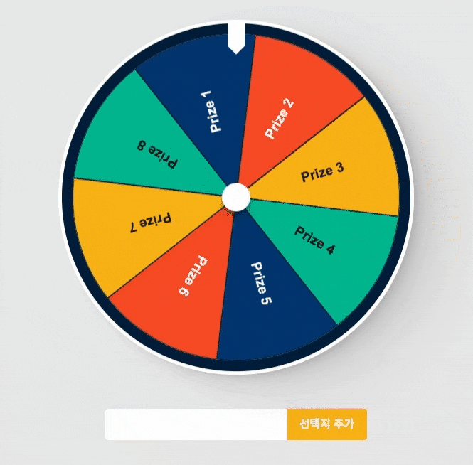

# 🎰 Roulette

---



사용자가 옵션을 추가하여 룰렛을 돌릴 수 있는 간단한 웹 어플리케이션입니다. <br />
버튼을 클릭하여 룰렛을 돌려보세요! 🎰

1. 저장소 복제

```
$ git clone https://github.com/cukehater/roulette.git
```

2. 디펜던시 설치

```
$ npm install
```

3. 실행

```
$ npm run dev
```

[결과 페이지](https://cukehater.github.io/roulette/)
